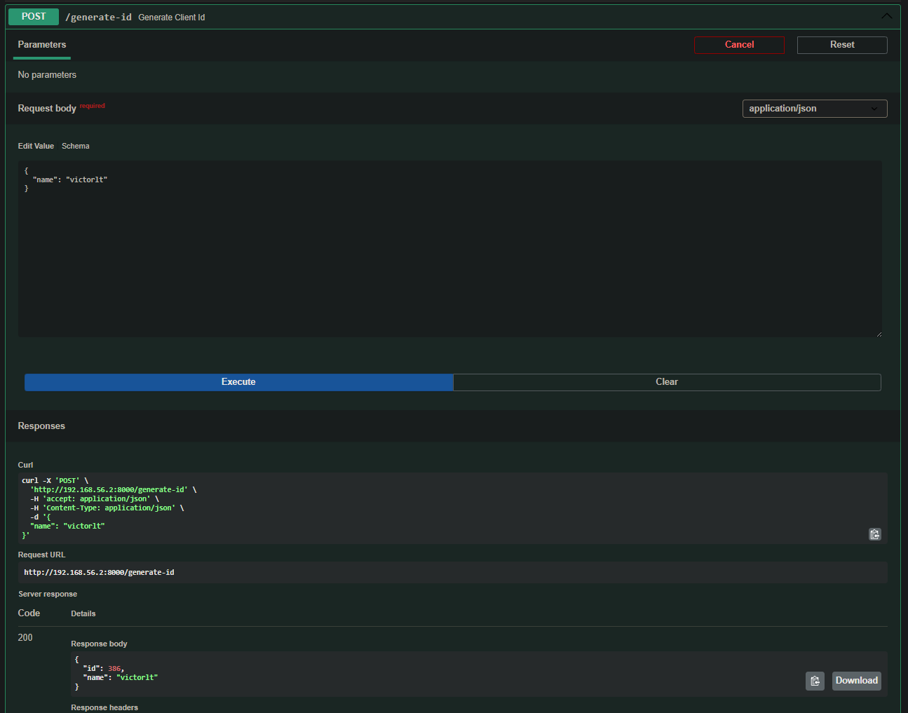

# BIG DATA APLICADO
## SERVICIOS
### 1. Crear, instalar y configurar VM
1.1: Descargar ISO Ubuntu Server 25.10 desde https://ubuntu.com/download/server/thank-you?version=25.10&architecture=amd64.
1.2: Crear VM en VirtualBox e instalar el sistema operativo desde la ISO que hemos descargado.
1.3: Ingresar en la VM y ejecutar los siguientes parámetros:
```bash
# Sudo sin contraseña para vagrant
echo "vagrant ALL=(ALL) NOPASSWD:ALL" | sudo tee /etc/sudoers.d/vagrant
```
```bash
# Instalar clave pública "insegura" de Vagrant
sudo mkdir -p /home/vagrant/.ssh
sudo chmod 0700 /home/vagrant/.ssh
sudo wget --no-check-certificate https://raw.githubusercontent.com/hashicorp/vagrant/mainkeys/vagrant.pub -O /home/vagrant/.ssh/authorized_keys
sudo chmod 0600 /home/vagrant/.ssh/authorized_keys
sudo chown -R vagrant:vagrant /home/vagrant/.ssh
```
```bash
# Instalar Guest Additions (para synced folders, vboxsf)
sudo apt-get update
sudo apt-get install -y build-essential dkms linux-headers-$(uname -r)
# desde la GUI de VirtualBox: Devices → Insert Guest Additions CD
sudo mount /dev/cdrom /mnt
sudo /mnt/VBoxLinuxAdditions.run
sudo reboot
```
```bash
# Limpiar y compactar disco antes de empaquetar
sudo apt-get clean
sudo dd if=/dev/zero of=/EMPTY bs=1M || true
sudo rm -f /EMPTY
sudo shutdown -h now
```
### 2. Crear box
2.1: Empaquetar VM a .box:
```powershell
vagrant package --base "[nombre_vm_virtualbox]" --output "[nombre_nueva_box].box"
```
2.2: Añadir box al inventario local de Vagrant:
```powershell
vagrant box add "[nombre_box]" file:///[ruta_absoluta_ubicacion.box]
# o si tienes problemas con la ruta en windows
vagrant box add "[nombre_box]" "[ruta_absoluta_ubicacion.box]"
```
2.3: Comprobar importación de la box:
```powershell
vagrant box list
```
### 3. Preparar la API
Creamos una subcarpeta en el mismo directorio donde estará ubicado el Vagrantfile y dentro de ella un archivo ```main.py``` con el siguiente código para FastAPI:
```python
import random
from fastapi import FastAPI
from pydantic import BaseModel

class ClientRequest(BaseModel):
    name: str

class ClientResponse(BaseModel):
    id: int
    name: str

app = FastAPI(
    title="Big Data Aplicado - Servicios",
    description="Crear un servicio con FastAPI que sea capaz de recoger un json con nombre de cliente y devuelva un id aleatorio",
    version="0.0.1"
)

@app.post("/generate-id", response_model=ClientResponse)
def generate_client_id(client: ClientRequest):
    return {"id": random.randint(1, 1000), "name": client.name}
```
### 4. Preparar el script de creación de nuevos usuarios
Creamos un archivo nuevo con extensión ```.sh``` en el mismo directorio donde estará ubicado el Vagrantfile e introducimos lo siguiente:
```shell
#!/bin/bash
USERNAME=$1
PASSWORD=$2

if id -u "$USERNAME" >/dev/null 2>&1; then
  echo "El usuario '$USERNAME' ya existe. Omitiendo la creación."
else
  sudo useradd -m -s /bin/bash "$USERNAME"
  echo "${USERNAME}:${PASSWORD}" | sudo chpasswd
  sudo usermod -aG sudo "$USERNAME"
  echo "Usuario '$USERNAME' creado con éxito."
fi
```
### 5. Crear Vagrantfile
5.1: Abrimos CMD y generamos un Vagrantfile vacío en el directorio mencionado en el paso anterior:
```powershell
vagrant init
```
5.2: Abrimos el Vagrantfile y escribimos en lenguaje Ruby todas las instrucciones siguientes:
```ruby
NEW_USERNAME = "victorlt"
NEW_PASSWORD = "victorlt"

Vagrant.configure("2") do |config|
    # ----------- BOX BASE -----------
    config.vm.box = "ubuntu_server_25_10_configurada"

    # ----------- RED -----------
    config.vm.network "private_network", ip: "192.168.56.2"
    config.vm.network "forwarded_port", guest: 80, host: 8080

    # ----------- CARPETA COMPARTIDA -----------
    config.vm.synced_folder "./fastapi", "/home/vagrant"
    
    # ----------- HARDWARE -----------
    config.vm.provider "virtualbox" do |vb|
        vb.name = "ubuntu_server_vagrant_01"
        vb.memory = "2048"
        vb.cpus = 2
    end

    # ----------- PROVISIONES -----------
    # Creación de nuevo usuario con las variables globales
    config.vm.provision "shell",
        path: "create_user.sh",
        args: [NEW_USERNAME, NEW_PASSWORD]

    # Clave pública en la VM (file + shell):
    config.vm.provision "file",
    source: File.expand_path("~/.ssh/id_rsa.pub"),
    destination: "/tmp/id_rsa.pub"
    
    config.vm.provision "shell", inline: <<-SHELL
        mkdir -p /home/#{NEW_USERNAME}/.ssh
        chmod 700 /home/#{NEW_USERNAME}/.ssh
        cat /tmp/id_rsa.pub >> /home/#{NEW_USERNAME}/.ssh/authorized_keys
        chmod 600 /home/#{NEW_USERNAME}/.ssh/authorized_keys
        chown -R #{NEW_USERNAME}:#{NEW_USERNAME} /home/#{NEW_USERNAME}/.ssh
    SHELL

    # Solo en la primera ejecución
    config.vm.provision "shell", run: "once" do |s|
        s.inline = <<-SHELL
            sudo add-apt-repository universe
            sudo apt update -y
            sudo apt install -y python3.13 python3.13-venv python3-pip

            # Crear el entorno virtual fuera del directorio compartido
            sudo python3.13 -m venv /opt/venv --without-pip
            sudo /opt/venv/bin/python3 -m ensurepip --upgrade
            sudo /opt/venv/bin/python3 -m pip install --upgrade pip
            sudo /opt/venv/bin/python3 -m pip install fastapi uvicorn
        SHELL
    end
end
```
### 6. Ejecutar Vagrantfile
Abrimos CMD en la misma ruta donde esté ubicado el Vagrantfile e introducimos el siguiente comando para que se lleve a cabo la creación e instalación automatizada de la VM con la ISO base más los nuevos parámetros definidos:
```powershell
vagrant up
```
### 7. Conectar a la VM
En la misma consola abierta que hemos usado en el paso anterior:
```powershell
vagrant ssh
```
### 8. Levantar el servicio
Primero activamos el entorno virtual:
```bash
source /opt/venv/bin/activate
```
Ahora ya podemos levantar el servidor:
```bash
uvicorn [nombre_archivo_compartido(sin .py)]:app --host 0.0.0.0 --port 8000
```
### 9. Probamos la conexión entre el host y la máquina virtual (API)
8.1: Abrimos el navegador web e introducimos en la barra de direcciones:
```bash
# Esto nos debería mostrar la documentación completa de la API.
192.168.56.2:8000/docs
```

### RESOLUCIÓN DE PROBLEMAS
#### 1. Error a la hora de crear una nueva VM y no coincide la private key:
- Eliminar máquina virtual:
```powershell
vagrant destroy -f
    
# Asegúrate de que se ha eliminado correctamente en:
C:\Users\[tu_nombre_de_usuario]\VirtualBox VMs\
```
- Eliminar carpeta ```.vagrant``` que se ha creado en el mismo directorio donde tenemos el Vagrantfile:
- Eliminar contenido de la carpeta ```.ssh```:
```powershell
C:\Users\[tu_nombre_de_usuario]\.ssh

# Si deseas regenerar la clave:
ssh-keygen -t rsa -b 4096
```
- Eliminar claves privadas almacenadas:
```powershell
C:\Users\[tu_nombre_de_usuario]\.vagrant.d\insecure_private_keys
```
- Reinstalar:
```powershell
vagrant up
```